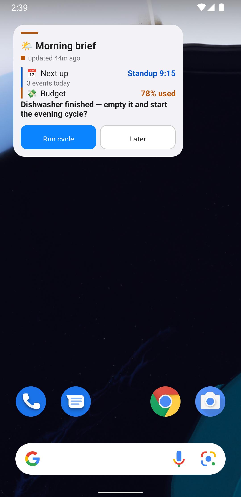

<div align="center">

# 📱 Slate

**The home-screen surface where your AI agent asks and answers.**

[](https://github.com/NickLewanowicz/slate/actions/workflows/backend.yml)
[](https://github.com/NickLewanowicz/slate/actions/workflows/android.yml)
[](https://nicklewanowicz.github.io/slate/)
[](LICENSE)


**Declarative Android home-screen widget for AI agents.** Push a tiny JSON document from your agent; the widget renders it; your taps flow back. Status boards, questions with canned answers, free text — self-hosted, no cloud relay, no accounts.

[Docs](https://nicklewanowicz.github.io/slate/) · [Getting started](#quick-start) · [Syntax reference](https://nicklewanowicz.github.io/slate/#elements) · [Examples](examples/)

</div>

---



## Why

AI agents that run your home are great at *doing* things and terrible at *asking*.
Crons report to a chat you'll scroll past; decisions stall waiting for you to
notice. Slate puts the decision on your home screen:

- 🌙 **Nightly status boards** — home assistant, email, backups, security, with semantic tone colors you can read from across the room
- ❓ **Questions with canned answers** — "Backup disk is full — purge?" → tap **Purge** on the widget → the agent picks the answer up on its next poll (or gets woken by a signed webhook)
- 💬 **Free text when canned isn't enough** — tap-through to the companion app
- ✅ **Visible loop closure** — the agent turns the answered question into a status row, so you can see it acted

Works with **any agent that can run curl** — [OpenClaw](https://openclaw.ai) (ships with a ready skill), Hermes, your own scripts.

<br clear="both">

## Quick start

**1 · Backend** (any host with [Bun](https://bun.sh) or Docker):

```bash
git clone https://github.com/NickLewanowicz/slate.git && cd slate/backend
bun install
SLATE_API_KEY=$(openssl rand -hex 24) bun run src/index.ts   # :3000
```

**2 · Phone** (Android 12+): install the APK from CI artifacts, paste the backend URL + key, add the **Slate** widget to your home screen.

**3 · Agent**: copy `skill/slate/` into your agent's skills directory (OpenClaw: `~/.openclaw/skills/`), or just point your agent at `docs/API_EXAMPLES.md`. Full walkthrough in the [docs](https://nicklewanowicz.github.io/slate/#start-agent).

**Or delegate the whole setup to your agent** — the docs site has a ready-to-paste [agent setup prompt](https://nicklewanowicz.github.io/slate/#agent-setup).

## The whole language is nine elements

```jsonc
{ "type": "statusRow", "icon": "💾", "label": "Backup",
  "value": "failed", "tone": "error", "detail": "disk full — 412 GB used" }
```

`column` · `row` · `text` · `statusRow` · `todoList` · `question` · `progress` · `divider` · `spacer` — semantic `tone`s (ok / warn / error / info / neutral), never raw colors. [Full reference →](https://nicklewanowicz.github.io/slate/#elements)

## Compatibility

| | |
|---|---|
|  | Widget + companion app (RemoteViews, minSdk 31) |
|  | Backend (any host with Docker works too) |
|  | Anything that can POST JSON |

## How it works

```
agent ──PUT /api/slates/{id}──▶ backend (SQLite) ──ETag/304──▶ widget (RemoteViews)
agent ◀─GET responses?since──────                 ◀─POST taps── app (Compose)
```

The contract is frozen in [`schema/`](schema/) (JSON Schemas + golden fixtures) and enforced on both sides. See [ARCHITECTURE.md](ARCHITECTURE.md) for the decisions behind it.

## Testing

Both sides enforce **≥80% branch coverage** in CI:

```bash
cd backend && bun run coverage                                    # 105 tests
cd android && ./gradlew :app:testDebugUnitTest :app:koverVerify   # 179 tests
```

## Docs

**[nicklewanowicz.github.io/slate](https://nicklewanowicz.github.io/slate/)** — getting started, syntax reference, interaction contract, API, examples. Source in [`docs/site/`](docs/site/).

## Contributing

PRs welcome — see [CONTRIBUTING.md](CONTRIBUTING.md). The coverage gates are enforced; error messages are part of the product (every failure needs an LLM-friendly `hint`).

## License

[MIT](LICENSE)
